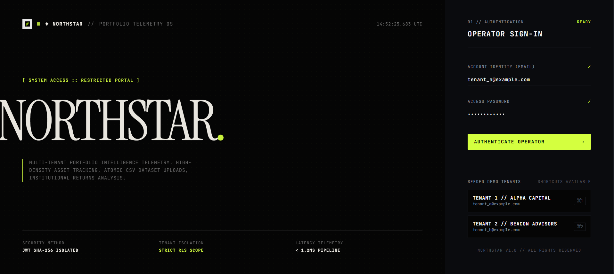
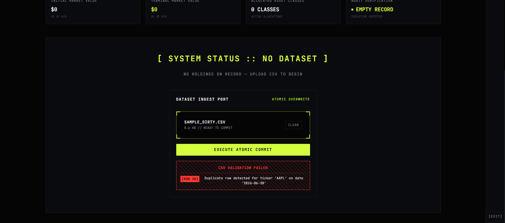
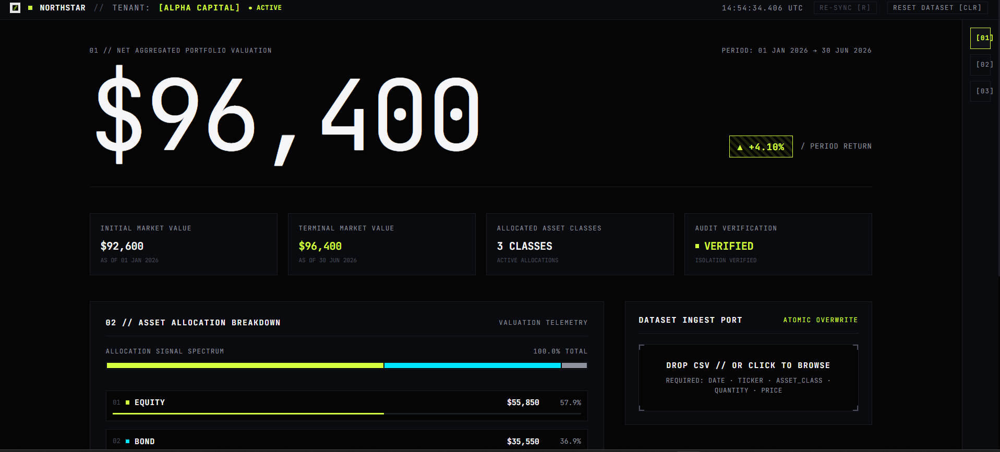
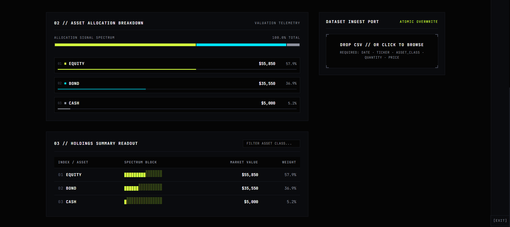

<p align="center">
  
</p>

# Northstar Portfolio

Institutional-Grade Multi-Tenant Investment Portfolio Analytics Platform  
Cold on the surface, precise underneath, lit by a single acid accent.

---

## Visual Interface Overview (2x2 Grid)

<table width="100%">
  <tr>
    <td width="50%" align="center">
      <b>01 // Operator Sign-In Interface</b><br/><br/>
      
    </td>
    <td width="50%" align="center">
      <b>02 // Validation Error Handling (Dirty CSV)</b><br/><br/>
      
    </td>
  </tr>
  <tr>
    <td width="50%" align="center">
      <b>03 // Portfolio Holdings & Telemetry</b><br/><br/>
      
    </td>
    <td width="50%" align="center">
      <b>04 // Asset Allocation Breakdown</b><br/><br/>
      
    </td>
  </tr>
</table>

---

## Architectural Topology

```text
+--------------------------------------------------------------------+
|                      Nginx / Vite Web Client                       |
|                  (React 18 + TS + Tailwind CSS)                    |
+--------------------------------─┬----------------------------------+
                                  |
                       HTTP / JSON (Bearer JWT)
                                  |
                                  v
+--------------------------------------------------------------------+
|                       Express Node.js API                          |
|                                                                    |
|  * JWT Auth & RLS Claims Decoders    * CSV Validation Pipeline     |
|  * Atomic PostgreSQL Transactions    * Portfolio Valuation Engine  |
+--------------------------------─┬----------------------------------+
                                  |
                     SQL (Parameterized Queries)
                                  |
                                  v
+--------------------------------------------------------------------+
|                    PostgreSQL 16 Alpine Database                   |
|                      (Docker Containerized)                        |
+--------------------------------------------------------------------+
```

---

## Technology Stack

- Frontend: React 18, TypeScript, Vite, Tailwind CSS v4, Framer Motion, Recharts
- Backend: Node.js, Express, PostgreSQL (`pg`), JWT (`jsonwebtoken`), bcryptjs, Multer, `csv-parse`
- Database & Containerization: PostgreSQL 16 Alpine, Nginx, Docker, Docker Compose

---

## Seed Credentials & Tenant Access

The database is pre-populated with two isolated tenant organizations for multi-tenant verification:

| Tenant | Access Email | Password | Tenant Name | Initial Dataset | Keyboard Shortcut |
| :--- | :--- | :--- | :--- | :--- | :--- |
| Tenant 1 | `tenant_a@example.com` | `Password123!` | Alpha Capital | Pre-loaded Holdings | `Cmd+1` / `Ctrl+1` |
| Tenant 2 | `tenant_b@example.com` | `Password123!` | Beacon Advisors | Pre-loaded Holdings | `Cmd+2` / `Ctrl+2` |

---

## Single-Command Setup & Execution

### Full Stack Execution (PostgreSQL + Express API + Nginx Frontend)

To start the entire application stack (Database, API, and Frontend) in a single command, run:

```bash
docker compose up --build
```

This single command automatically starts:
1. PostgreSQL 16 Database on `localhost:5432` with seeded schema and users.
2. Express API Backend on `http://localhost:5000`.
3. Nginx Web Client serving the compiled frontend on `http://localhost:80` (and `http://localhost:5173`).

Open your web browser at:
`http://localhost` or `http://localhost:5173`

---

## Multi-Tenant Row-Level Security (RLS)

1. JWT Claim Source of Truth: All backend routes extract `tenant_id` directly from the authenticated JWT token. Query parameters or request body overrides like `?tenantId=2` are strictly ignored.
2. Parameterized SQL Execution: Database operations use positional placeholders (`WHERE tenant_id = $1`) to prevent cross-tenant data leakage and SQL injection.
3. Verified Data Boundaries: Dataset operations (uploading or clearing holdings) for Tenant A leave Tenant B's data completely untouched.

---

## CSV Format & Validation Rules

Holdings datasets are uploaded via CSV format with exact column headers:

```csv
date,ticker,asset_class,quantity,price
2026-01-01,AAPL,Equity,100,150.00
2026-01-01,MSFT,Equity,100,350.00
2026-01-01,AGG,Bond,400,94.00
2026-01-01,USD,Cash,5000,1.00
2026-06-30,AAPL,Equity,100,178.50
2026-06-30,MSFT,Equity,100,380.00
2026-06-30,AGG,Bond,350,95.00
2026-06-30,BND,Bond,23,100.00
2026-06-30,USD,Cash,5000,1.00
```

### Period Return Formula
The period return metric is computed across the dataset timeframe:

```text
period_return = (end_market_value - start_market_value) / start_market_value
```

$$\text{period\_return} = \frac{\text{end\_market\_value} - \text{start\_market\_value}}{\text{start\_market\_value}}$$

- Start Market Value: Sum of `quantity * price` for all holdings on the earliest date (`MIN(holding_date)`).
- End Market Value: Sum of `quantity * price` for all holdings on the latest date (`MAX(holding_date)`).

### Validation & Atomic Transaction Rules
- Field Presence: Required columns (`date`, `ticker`, `asset_class`, `quantity`, `price`).
- Data Types: ISO date format (`YYYY-MM-DD`), numeric `quantity > 0`, non-negative `price >= 0`.
- In-File Duplicate Detection: Flags duplicate entries for the same ticker and date with row-specific errors (`[ROW 04]`).
- Atomic Rollback: Imports run inside `BEGIN ... ROLLBACK` SQL transactions. Any invalid row aborts the entire import, preventing data corruption.

Files Provided:
- `sample_good.csv`: Valid dataset producing +4.10% Period Return ($92,600 -> $96,400).
- `sample_dirty.csv`: Contains a duplicate row to demonstrate validation error handling.

---

## API Specifications

### 1. Operator Authentication
```http
POST /api/auth/login
Content-Type: application/json

{
  "email": "tenant_a@example.com",
  "password": "Password123!"
}
```

### 2. Portfolio Telemetry Readout
```http
GET /api/dashboard
Authorization: Bearer <token>
```

### 3. Holdings CSV Dataset Upload
```http
POST /api/holdings/upload
Authorization: Bearer <token>
Content-Type: multipart/form-data (file: CSV)
```

### 4. Atomic Dataset Reset
```http
DELETE /api/holdings
Authorization: Bearer <token>
```

---

## Key Assumptions

- Full Snapshot Replacement: Each uploaded CSV replaces the tenant's active portfolio snapshot atomically.
- Market Valuation: Valuation is calculated as `quantity * price`.
- Date Scope: Start date equals earliest date in uploaded CSV; end date equals latest date.

---

## Future Improvements (With More Time)

- Automated End-to-End Tests: Cypress / Playwright test suite for tenant isolation and error handling.
- Historical Snapshot Comparison: Multi-period historical tracking across custom date ranges.
- Granular Asset Class Drilling: Drill-down modal for individual ticker performance.

---

NORTHSTAR OS v1.0.0 // All Rights Reserved
